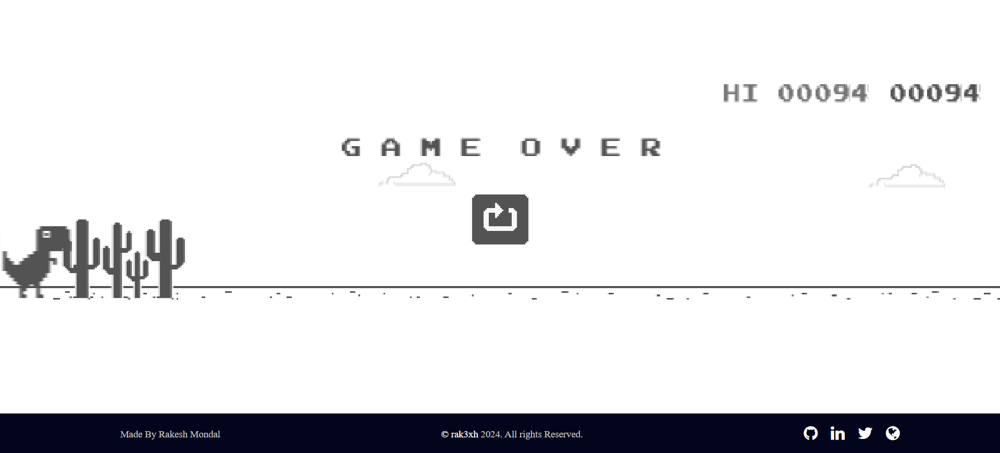

# Dinosaur Game - Chrome Offline Screen Recreation

<p align="center">




</p>

## Overview

This project is a faithful recreation of the famous "Dinosaur Game" that appears on the Google Chrome offline error page. Built with HTML, CSS, and JavaScript, this project aims to replicate the look and feel of the original game, allowing users to enjoy it even when they're online!

## Features

- **Pixel-Perfect Design:** The game closely mimics the visual style of the original Chrome Dinosaur Game.
- **Responsive Gameplay:** Smooth animations and responsive controls for an enjoyable user experience.
- **Score Tracking:** Keep track of your high score as you avoid obstacles.
- **Keyboard Controls:** Use the spacebar or up arrow key to jump over obstacles.

## Demo

You can try the game live [here](https://chrome-dinosaur-game-by-rak3xh.vercel.app/).

## Installation

To run this project locally:

1. Clone the repository:
   ```bash
   git clone https://github.com/rak3xh/Chrome-DinosaurGame-by-rak3xh.git
   ```
2. Navigate to the project directory:

```bash
cd Chrome-DinosaurGame-by-rak3xh
```

3. Open `index.html` in your web browser

## How to Play

- **Jump:** Press the spacebar or the up arrow key to make the dinosaur jump over obstacles.

- **Avoid Obstacles:** Avoid hitting cacti and birds to keep the game going.
- **High Score:** The game keeps track of your highest score, so you can always aim to beat it!

## Technologies Used

- **HTML5:** For the structure of the game.

- **CSS3:** To style the game and create pixel-perfect graphics.
- **JavaScript:** Handles the game logic, including collision detection, score tracking, and animations.

## Contributing

If you'd like to contribute to this project, please feel free to fork the repository and submit a pull request with your enhancements or bug fixes.

## License

This project is licensed under the MIT License. See the [LICENSE](LICENSE) file for more details.

## Acknowledgements

- Thanks to Google for the original inspiration and design of the Dinosaur Game.

- Special thanks to the open-source community for providing valuable resources and tools.

## Contact

For any inquiries or suggestions, feel free to reach out via [email](rakeshmondal859@gmail.com) or create an issue on GitHub.
